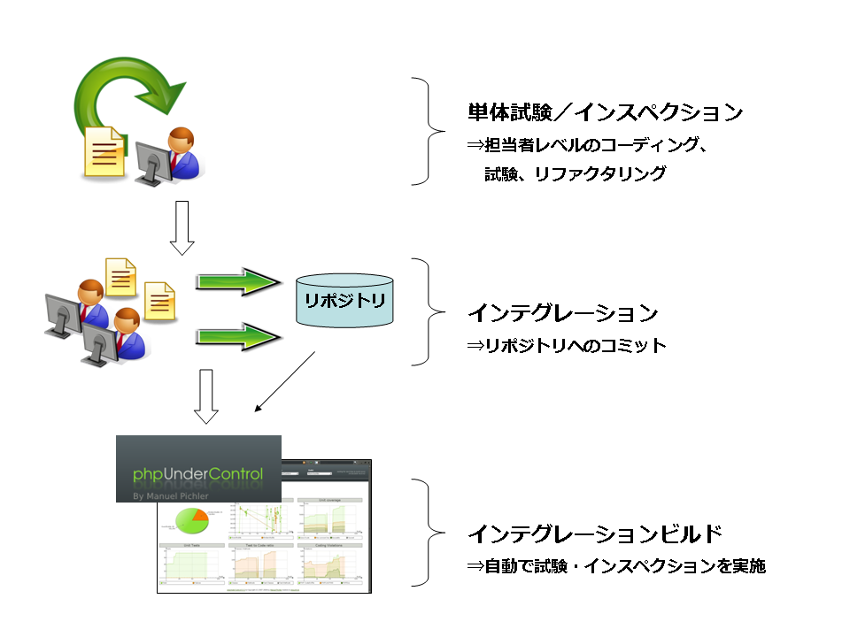

# 継続的インテグレーションのすゝめ

2013年6月21日

永宮　悠大

## 継続的インテグレーション

> チームのメンバーが各自の成果物を頻繁に統合するソフトウェア開発のプラクティスである。
> 通常、最低でも1日に1度以上は各自でインテグレーション作業を行う。
> インテグレーション時のエラーをできるだけ早く検出できるよう、すべてのインテグレーションは、
> テストを含めた自動化されたビルドによって検出される。

## イメージ

## 期待できる効果

## 開発を効率化します

## というのは嘘で・・・

## 仕様変更が頻繁に発生する開発を効率化します

## 開発コストのイメージ

## 迅速なフィードバックを可能にします

## ビルド状況

* ビルド成功時はグリーン、失敗時はレッドになる
* リポジトリ単位でプロジェクトを作成可能

## 単体試験

* テスト成功時はグリーン、失敗時はレッドになる

## カバレッジ

* カバレッジの度合いを色分けして表示
  * 「高」はグリーン
  * 「中」は黄色
  * 「低」は赤
* ファイル名をクリックすると、コードレベルで通っている箇所が色づけされるので便利

## コーディング規約チェック

* プロジェクトで決めたコーディング規約が遵守されているかチェック
* Error（重度な違反）、Warning（軽度な違反）の2段階

## コード改善

* コードの改善点を指摘してくれる
  * メソッドが長すぎる
  * クラスが大きすぎる
  * ロジックが複雑すぎる
  * など

## 品質を視える化します

## ビルドのメトリクス

## 具体例1

（´-`）.｡oO（カバレッジが高いので安心だな）

## 具体例2

（´-`）.｡oO（よし、コーディング規約は守られているな）

（´-`）.｡oO（最初の頃はひどかった…）

## 具体例3

* 実コードが増えたらテストコードも増えている

  ⇒テストしている 

* 実コードが増えたのにテストコードが増えていない

  ⇒テストしていない

（´-`）.｡oO（よし、みんなしっかりテストを書いてるな）

## 具体例4

* オレンジ（失敗ビルド）が多い

  ⇒開発が盛んに行われている

* グリーン（成功ビルド）が多い

  ⇒軽微な開発が続いている

（´-`）.｡oO（開発もだいぶ落ち着いてきたなぁ）

## 必要なもの

* 継続的インテグレーションツール
  * phpUnderControl
  * CruiseControl
  * Jennkins
* 継続的インテグレーション用サーバ
* バージョン管理システム
  * Subversion、Gitなど
* テストコード

## 運用フロー例

## まとめ

## 継続的インテグレーションの効果

* 仕様変更が頻繁に発生する開発の効率化
* 迅速なフィードバック
* 品質の視える化

## Let's Enjoy Continuous Integratioan Life!

## Thank You!

BY Yuta Nagamiya
